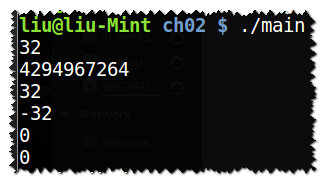
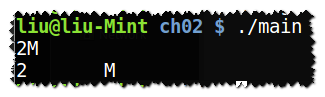

## Note

**无符号类型**：

当赋给无符号类型一个超范围的值时，结果是初始值对无符号类型表示数值总数取摸后的余数。  

在一个算数表达式中，带符号数会自动转换为无符号数。

**进制：**

0开头为八进制

0x开头为十六进制

**指定字面值的类型：**

字符和字符串字面值：

|  前缀  |      含义       |    类型     |
| :--: | :-----------: | :-------: |
|  u   | Unicode 16 字符 | char16\_t |
|  U   | Unicode 32 字符 | char32\_t |
|  L   |      宽字符      | wchar\_t  |
|  u8  |  UTF-8(字符串)   |   char    |

整型字面值：

|  后缀   |  最小匹配类型   |
| :---: | :-------: |
|  u/U  | unsigned  |
|  l/L  |   long    |
| ll/LL | long long |

浮点型字面值：

默认浮点型字面值为double类型。

|  后缀  |     类型      |
| :--: | :---------: |
| f/F  |    float    |
| l/L  | long double |

**初始化与赋值：**

初始化不是赋值。

初始化的含义是创建变量时赋予其初始值，而赋值是指把对象的当前值擦除，以一个新值替代。

编译器会区别这两种情 况，赋值的时候调用重载的赋值运算符，初始化的时候调用拷贝构造函数。其中赋值操作比初始化操作要慢，因为赋值操作会产生一个临时性的中间对象，这个临时性的中间对象会给被赋值对象赋值，导致开销变大。

成员初始化的顺序仅依赖于**成员定义的顺序**，而不是初始化列表中的顺序。

[C＋＋初始化与赋值](http://www.cnblogs.com/chio/archive/2008/10/06/1305145.html)

**声明和定义：**

声明使得名字为程序所知，使用别处定义的名字则需包含其声明；定义负责创建与名字关联的实体（行为）。

关键字`extern`声明一个变量。

变量只能被定义一次，可以被声明多次。

**复合类型：**给予其他类型定义的类型。

引用和指针属于复合类型。

**左值引用与右值引用：**

- 左值是可以位于赋值运算符 `=` 左侧的表达式（当然，左值也可以位于 `=` 的右侧），而
- 右值是不可以位于赋值运算符 `=` 左侧的表达式。

一个表达式是左值还是右值，取决于我们使用的是它的值还是它在内存中的位置（作为实例的身份）。也就是说一个表达式具体是左值还是右值，要根据实际在语句中的含义来确定。

[谈谈 C++ 中的右值引用](https://liam0205.me/2016/12/11/rvalue-reference-in-Cpp/)

[从4行代码看右值引用](http://www.cnblogs.com/qicosmos/p/4283455.html)

## Exercise

**2.1 类型 int、long、long long 和 short 的区别是什么？无符号类型和带符号类型的区别是什么？float 和 double的区别是什么？**

类型 int、long、long long 和 short 的区别：尺寸大小不同，short <= int <= long <= long long

无符号类型和带符号类型的区别​: 带符号类型可以表示正数、负数或0，无符号类型仅能表示大于等于0的值。

float 和 double的区别：float以1个字(32 bit)来表示，有7个有效位；double以2个字（64 bit）来表示，有16个有效位。

**2.2 计算按揭贷款时，对于利率、本金和付款分别应选择何种数据类型？说明你的理由。**

利率：double

本金：double

付款：float

double和float应该都可以，但是double精度更高一点。

**2.3 读程序写结果。**

```c++
unsigned u = 10, u2 = 42;
std::cout << u2 - u << std::endl;
std::cout << u - u2 << std::endl;

int i = 10, i2 = 42;
std::cout << i2 - i << std::endl;
std::cout << i - i2 << std::endl;
std::cout << i - u << std::endl;
std::cout << u - i << std::endl;
```

32    ~~32~~

32    -32    0    0

**2.4 编写程序检查你的估计是否正确，如果不正确，请仔细研读本节直到弄明白问题所在。**

[2\_3\_main.cpp](https://github.com/liuyanfight/cpp/blob/master/code/ch02/2_3_main.cpp)



` i - u2`:4294967264

也就是说，当无符号数相减超出范围时得到取摸后余数，int值转换为无符号数时同理。

**2.5 指出下述字面值的数据类型并说明每一组内几种字面值的区别：**

**(a) 'a', L'a', "a", L"a"**

**(b) 10, 10u, 10L, 10uL, 012, 0xC**

**(c) 3.14, 3.14f, 3.14L**

**(d) 10, 10u, 10., 10e-2**

a：字符，宽字符，字符串，宽字符串

b：整型，无符号整型，长整型，无符号长整型，八进制，十六进制

c：double，float，long double

d：整型，无符号整型，浮点型，浮点型

**2.6 下面两组定义是否有区别，如果有，请叙述之：**

```c++
int month = 9, day = 7;
int month = 09, day = 07;
```

有，以0开头为八进制整型值。但是month无效，因为八进制中没有9.

**2.7 下述字面值表示何种含义？它们各自的数据类型是什么？**

**(a) "Who goes with F\145rgus?\012"**

**(b) 3.14e1L**

**(c) 1024f**

**(d) 3.14L**

a：Who goes with Fergus？（换行），string

b：31.4, long double

c：~~1024，float~~ 无效，1024为整型，不能使用后缀f

d：3.14，long double

[ASCII码](http://www.asciitable.com/) 145为e 012为换行

**2.8 请利用转义序列编写一段程序，要求先输出 2M，然后转到新一行。修改程序使其先输出 2，然后输出制表符，再输出 M，最后转到新一行。**

[2\_8\_main.cpp](https://github.com/liuyanfight/cpp/blob/master/code/ch02/2_8_main.cpp)



**2.9 解释下列定义的含义，对于非法的定义，请说明错在何处并将其改正。**

- **(a) std::cin >> int input_value;**
- **(b) int i = { 3.14 };**
- **(c) double salary = wage = 9999.99;**
- **(d) int i = 3.14;**

a：不应该在cin时定义，先定义再使用

b：存在初始值丢失的风险

c：wage未定义

d：定义i并初始化为3

**2.10 下列变量的初值分别是什么？**

```c++
std::string global_str;
int global_int;
int main()
{
    int local_int;
    std::string local_str;
}
```

gloal\_str、global\_int为全局变量，执行默认初始化，初始化为空字符串和0.

locak\_int在函数体内未初始化，因此其值未定义；local\_str类型为string，初始化为空字符串。

**2.11 指出下面的语句是声明还是定义：**

- **(a) extern int ix = 1024;**
- **(b) int iy;**
- **(c) extern int iz;**

a：定义

b：~~声明~~ 定义

c：声明

**2.12 请指出下面的名字中哪些是非法的？**

- **(a) int double = 3.14;**
- **(b) int _;**
- **(c) int catch-22;**
- **(d) int 1\_or\_2 = 1;**
- **(e) double Double = 3.14;**

非法：a，~~b~~，c，~~e~~，d

**2.13 下面程序中 j 的值是多少？**

```c++
int i = 42;
int main()
{
    int i = 100;
    int j = i;
}
```

j=100

**2.14下面的程序合法吗？如果合法，它将输出什么？**

```c++
    int i = 100, sum = 0;
    for (int i = 0; i != 10; ++i)
        sum += i;
    std::cout << i << " " << sum << std::endl;
```
100 45

