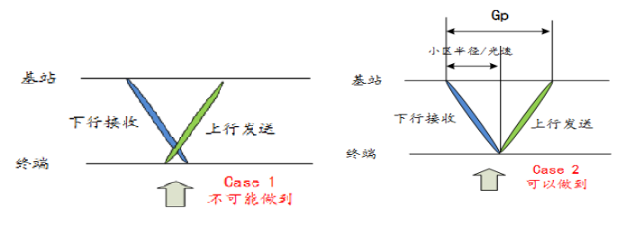
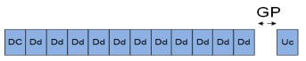
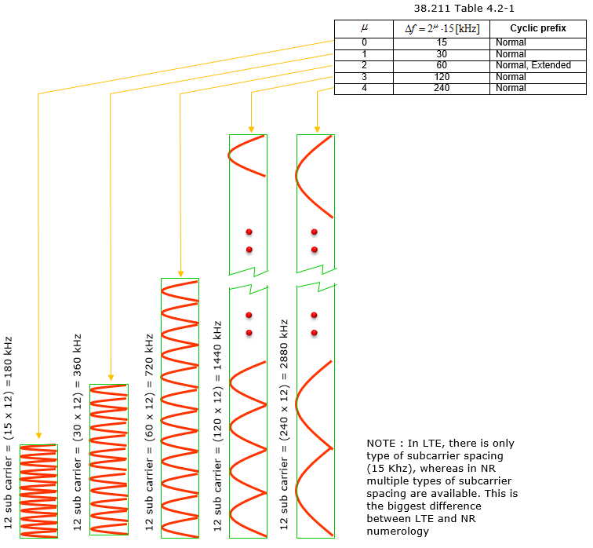
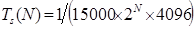
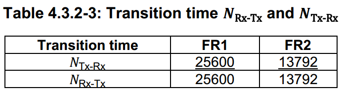
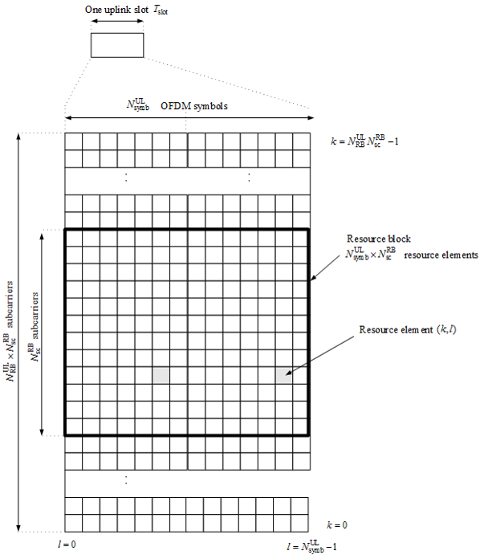
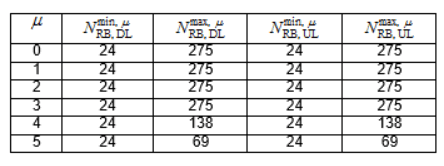

> 公司大牛最近每周牺牲晚上时间给大家讲5G，不认真听讲认真整理笔记的话就太浪费了。希望学有所得。
>
> PS：可以发吗？能发吗？不管了，反正没人看 :sweat_smile:。个人笔记
>
> 20180620, 第二轮了。。。啪啪啪

 

## 序章一：物理层先验概念

### GP的概念

如上图case1是不可能做到的，也就是说UE发射接收机不可能同时工作在发射和接收两个频率上。但case2的情况，就是任意一个发射接收机能够做到的。而基站从下行接收到上行发送之间的间隔就是GP(Guard Period). GP的大小就是(小区半径\*2)/c（c为光速）。

__Q:从下行到上行需要GP，那么从上行到下行是否需要GP呢？__

从上行到下行，对于终端来说天然就带有一段GP所以不需要额外的GP。

**Q:TDD需要GP，FDD需要吗？**

FDD上下行会在不同频率不造成相互干扰，因此不需要GP

> **[LTE GP – Guard Period](http://blog.csdn.net/wo17fang/article/details/41787909)**
>
> In LTE , the radio frame structure type 2 is used for TDD operation and consists of two half-frames with a duration of 5ms each and containing each 8 slots of length 0.5ms and three special fields ( DwPTS , GP and UpPTS ) which have configurable individual lengths and a total length of 1ms. The GP is between the DwPTS and the UpPTS.

GP根据DwPTS、UpPTS长度，GP长度对应为1~10个symbol。 保证距离天线远近不同的UE上行信号在eNodeB的天线空口对齐；提供上下行转化时间 （eNodeB的上行到下行的转换实际也有一个很小转换时间Tud，小于20us），避免相邻基站 间上下行干扰 ；GP可以防止信道间干扰(ICI)。

电磁波的传送时间与距离息息相关，其损耗除了距离上的消耗还包括多径（折射）引起的时间消耗。因此，任何上行传输，都会提前至少(小区半径/c)。

在3G TDSCDMA， 4G TDD和5G的帧结构中，Gp的位置就是为了适应上行传送提前于下行传送。因此，Gp就位于DL symbol和UL symbol的转换中间，如下图。

TODO: **Q:LTE GP与5G GP的区别？**

[LTE GP](https://blog.csdn.net/lyj11111111/article/details/76724417)这里的GP2与TA? 

### 频率与波长

频率越高的电磁波衰减越快，绕射和衍射现象越弱（越高的频率，波动性越不明显，而粒子性越明显）。方向性就越好，**beam forming**就有了用武之地（但会存在阴影衰弱）。

>**[为什么频率越大的光粒子性越显著？](https://zhidao.baidu.com/question/1831757384588954340.html)**
>
>这主要可以从波长的物理意义来看.
>波长越长的话,波的衍射、干涉等波所独有的现象也就越明显.因此,可以说是波动性越明显,我们越容易观察到物体的干涉、衍射这些反应波动性的现象.
>而“频率越高,粒子性越明显”,你可以从相反角度理解,频率与波长成反比,频率高了,起波长必定小,也就是说越难观察到物质的符合波动的行为,因此说粒子性越明显!
>
>**阴影衰落**是指电磁波在传播路径上受到建筑物阻挡产生的阴影效应所带来的损耗。

__为什么频率越高，beam就越强？__

频率越高，光的粒子性越明显，当光源合适时在某一个方向上能量会更强（[双缝干涉](https://baike.baidu.com/item/%E5%8F%8C%E7%BC%9D%E5%B9%B2%E6%B6%89)），也就是beam越强。

> [波长，频率，传播距离三者的关系](https://blog.csdn.net/guomutian911/article/details/42919283)
>
> **定理：速度 =波长 * 频率；**
>
> 在光波里面,波长*频率=一个定值,所以波长越长,频率就会越小.
> 波长越长,穿透力越强(容易绕过障碍物,发生衍射),反之就弱.
> 频率越高,分辨率就越高,反之即然.
> 红外线望远镜(波长长)能在有雾的地方看得比普通的要远好多,就连窗帘布也能穿过.
> 紫外线照相机(频率高)常用于拍指纹.(用于犯罪侦破)。

> [Ref：5G无线通信与4G的典型区别有哪些？用了哪些新技术？ - 小枣君的回答 - 知乎](https://www.zhihu.com/question/53878059/answer/196639397 )
>
>  
>
> 5G频段分为<6GHz与>25GHz两种，对于国际上通用的28GHz来说， 
>
> 即mmW毫米波。**频率越高（波长越短），就越趋近于直线传播（绕射能力越差）**
>
> 根据天线特性，天线长度应与波长成正比，大约在1/10~1/4之间。多天线阵列要求天线之间的距离保持在半个波长以上。高频率所需的天线长度更短，进而**Massive MIMO**就可以派上用场啦 。

### 5G中3GPP的物理帧格式

#### 子载波间隔SCS

子载波间隔(SCS, sub-carrier spacing):$\Delta f=2^N·15kHz$, N的范围从0到5.

Note: the dedicated SCS for nominal and SS block(30kHz) are different `  数据帧的scs和ssb的scs是不一样的`

> [为什么5G这样设计空口物理层？](http://www.txrjy.com/thread-1027912-1-1.html)
>
> 3GPP Release 15协议为5G空口规定了5种*物理层波形*，对应的子载波间隔分别为15KHz、30KHz、60KHz、120KHz和240KHz 
>
> 因为5G业务使用的频段的跨度很大，部署方式也多种多样，因此需要一个可以灵活扩展的OFDM numerology 。在15KHz的子载波间隔的基础上，设计出更多的大子载波间隔的numerology后，5G NR就能为用户提供对时延有苛刻要求的业务，如URLLC业务——这种能力是LTE无法提供的。
>
> OFDM符号的持续时间与子载波间隔成反比。由于在所有的numerology中，每个时隙中的OFDM符号数量都一样（14 OFDM符号/时隙），这意味着随着子载波间隔变大，时隙的持续时间变短。将所有numerology中的“OFDM符号数量/时隙”参数固定为14，简化了调度机制和参考信号设计。而更重要的是，使用大子载波间隔时，时延减少了。
>
> 另外，OFDM调制器的最大FFT采样数和子载波间隔决定了信道带宽，因此大子载波间隔的numerology需要较大的信号带宽，小子载波间隔的numerology则相反。5G NR使用的频段可大致分成两段：小于6GHz的频段（sub 6GHz），频率范围是450MHz——6000MHz，和毫米波频段（mmWave），频率范围是24250MHz——52600MHz。在sub6GHz频段，最大带宽是100MHz；在mmWave频段，最大带宽可以达到400MHz。因此，子载波间隔为15KHz和30KHz的numerology只能用在sub6GHz频段，子载波间隔为120KHz的numerology只能用在毫米波频段，而子载波间隔为60KHz的numerology则两类频段都能使用。 

**Q:为什么频率越高，子载波间隔越大?**

在sub6GHz频段，最大带宽是100MHz；在mmWave频段，最大带宽可以达到400MHz。

4G中子载波间隔是固定为15Khz的，但是由于5G在高频，可使用的带宽很大，所以引入了一个新名词：numerology（通信系统所用的一套参数，包括子载波间隔，符号长度，CP长度等等 ）。5G中，子载波间隔不像4G时代固定为15Khz，而是可变的，但**一个RB还是12个子载波**。

#### 码片长度 Sample time units

采样时间(码片长度, Sample time units): 

5G NR最大为 $T_c=1/(\Delta f ·N_f)$其中$\Delta f_{max}=480·10^3Hz $, $N_f=4096$

$\kappa=T_s/T_c=64$其中$T_s=1/（\Delta f_{ref}·N_{f,ref}), \Delta f_{ref}=15·10^3Hz$ and $N_{f, ref}=2048$

#### 无线帧(Radio frame)

  $T_f=(\Delta f_{max}N_f/100)·T_c=10ms$

Subframe and Slot: subframe=1ms, each subframe is made of  $2^u$  slots

Symbols: each slot has 14 OFDM symbols(normal CP), 12 OFDM symbols(extend CP)

5G中slot的概念得到强化，不同的slot格式带来不同使用场景的变化。调度器和L1都是工作在以slot为周期的节奏上了 .

> [5G无线通信与4G的典型区别有哪些？用了哪些新技术？ - Kyle的回答 - 知乎](https://www.zhihu.com/question/53878059/answer/235779847 )
>
> [5G无线帧结构与空口物理层资源](http://www.360doc.com/content/18/0127/23/40903010_725649604.shtml)
>
> [Frame Structure](http://sharetechnote.com/html/5G/5G_FrameStructure.html)

Subframe Structure。我们知道，4G中一个无线帧为10ms，一个子帧为1ms，一个slot为0.5ms。到了5G，无线帧和子帧的长度没有变化，依然为10ms和1ms。但是slot长度变成了可配置的，其值依赖于两个个参数：μ和slot configuration。看下面的图：

 

当μ为,0，slot configuration为0时，1个无线帧包含10个子帧，1个子帧包含1个slot，1个slot包含14个symbol。如下图所示。

 

当μ为1，slot configuration为0时，就变成了下面的情况：1个子帧包含两个slot，每个slot都有14个symbol，也就是说1个子帧包含28个symbol。

以此类推，当μ配成5，slot configuration配成0时，1个子帧最多可以有32*14=448个symbol，比symbol多了10几倍呢。这就给速率成倍提升带来了可能性。

频率越高，子载波越宽，slot长度越短。

#### Signaling of slot formats  

slot中的OFDM symbols 可分为`downlink`, `flexible`, or `uplink`. 

在复合类型中，

- UE收到dl symbol与ul symbol之间的间隔应该大于$N_{Rx-Tx}T_c$
- UE收到ul与dl间隔应该大于$N_{Tx-Rx}T_c$

### 物理资源

#### 天线端口 antenna port

天线发射单元：物理上的天线

实际上在物理层规范中，antenna port一般我称作“逻辑天线端口”，实际上是指物理层处理单元对要发送或者接受的数据/符号的处理方式，不同的逻辑天线端口用来区分不同的处理方式  

#### 资源栅格(Resource Grid)

给定天线端口$p$, 子载波配置$\mu$和传输方向（上,下行)对应一个resource grid。

一般所说额子载波频率是指这个子载波的中心。

#### RE(Resource element)

RE是物理层定义的最小时间-频率资源单元，其定义为在时间上一个symbol，频率上一个子载波这样一个单元格。

一个RE承载一个调制后的符号，具体几个bit呢，取决于调制方式

**RB或者说PRB(Resource Block) **

这是L2（一般是指PS）所能看到的时频资源块，是一个Slot内的，12个子载波构成一个PRB.

在resource grid中的对应天线端口$p$,子载波配置$\mu$的每个元素就是RE。

RE可被$(k,l)_{p,\mu}$唯一标识，对应着一个PRB $a_{k,l}^{(p,\mu)}$

上下行的各自的最大RB数和最小RB数定义如下：（这个和LTE不同）

#### Resource blocks

每个RB在频率上有**12**个子载波(SCS).

Q: [PointA and CRB0](http://www.txrjy.com/thread-1037925-1-1.html)

#### BWP

> [5G/NR学习笔记：3GPP 38.211- Carrier Bandwith Part, BWP-载波带宽部分](https://blog.csdn.net/milkbusy/article/details/81606230)
>
> 

### 调制

> IQ调制与BPSK、QPSK和QAM [通信里 星座图 到底是什么意思啊? - 云外阳光的回答 - 知乎](https://www.zhihu.com/question/23107539/answer/72521819)

#### OFDM基带信号产生

> [OFDM中比较重要的细节理解](https://blog.csdn.net/Reborn_Lee/article/details/80812615)

