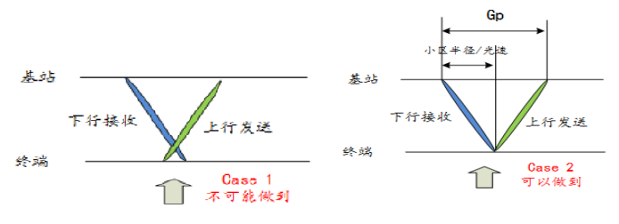

> 公司大牛最近每周牺牲晚上时间给大家讲5G，不认真听讲认真整理笔记的话就太浪费了。希望学有所得。
>
> PS：可以发吗？能发吗？不管了，反正没人看 :sweat_smile:。个人笔记

## 序章一：物理层先验概念

### GP的概念

如上图case1是不可能做到的，也就是说发射接收机不可能同时工作在发射和接收两个频率上。但case2的情况，就是任意一个发射接收机能够做到的。而基站从下行接收到上行发送之间的间隔就是GP(Guard Period). GP的大小就是(小区半径\*2)/c（c为光速）。

> **[GP – Guard Period](http://blog.csdn.net/wo17fang/article/details/41787909)**
>
> In LTE , the radio frame structure type 2 is used for TDD operation and consists of two half-frames with a duration of 5ms each and containing each 8 slots of length 0.5ms and three special fields ( DwPTS , GP and UpPTS ) which have configurable individual lengths and a total length of 1ms. The GP is between the DwPTS and the UpPTS.

GP根据DwPTS、UpPTS长度，GP长度对应为1~10个symbol。 保证距离天线远近不同的UE上行信号在eNodeB的天线空口对齐；提供上下行转化时间 （eNodeB的上行到下行的转换实际也有一个很小转换时间Tud，小于20us），避免相邻基站 间上下行干扰 ；GP可以防止信道间干扰(ICI)。

电磁波的传送时间与距离息息相关，其损耗除了距离上的消耗还包括多径（折射）引起的时间消耗。因此，任何上行传输，都会提前至少(小区半径/c)。

在3G TDSCDMA， 4G TDD和5G的帧结构中，Gp的位置就是为了适应上行传送提前于下行传送。因此，Gp就位于DL symbol和UL symbol的转换中间，如下图。

频率越高的电磁波衰减越快，绕射和衍射现象越弱（越高的频率，波动性越不明显，而粒子性越明显）。方向性就越好，beam forming就有了用武之地（但会存在阴影衰弱）。

>**[为什么频率越大的光粒子性越显著？](https://zhidao.baidu.com/question/1831757384588954340.html)**
>
>这主要可以从波长的物理意义来看.
>波长越长的话,波的衍射、干涉等波所独有的现象也就越明显.因此,可以说是波动性越明显,我们越容易观察到物体的干涉、衍射这些反应波动性的现象.
>而“频率越高,粒子性越明显”,你可以从相反角度理解,频率与波长成反比,频率高了,起波长必定小,也就是说越难观察到物质的符合波动的行为,因此说粒子性越明显!
>
>**阴影衰落**是指电磁波在传播路径上受到建筑物阻挡产生的阴影效应所带来的损耗。

### 5G中3GPP的物理帧格式

SCS(sub-carrier spacing):

