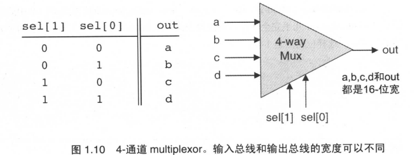

> 机缘巧合，有机会可以学习这门课。问题是自己的毅力实在不足从九月份到十二月份重置了无数次，才看到第二周。今年给自己的打分绝对是1分。
>
> From Nand to Tetris是希伯来大学的一门网络课程。选择这门课的初衷是因为毕竟从事通信行业，想要从更底层了解一下计算机。事实证明它也确实很有用，L1物理层就需要了解HDL编程。

# Week1 Overview

## Hello, World Below

### 课程目的

1. 计算机如何工作
2. 如何将复杂问题分解为易于管理的模块
3. 如何开发大规模硬件和软件系统

### 向下通往硬件领地之路

任何程序在实际运行之前，首先必须被翻译成某种目标计算机平台的机器语言。其编译过程可被划分为若干个抽象层级：

- 编译器
- 虚拟机
- 汇编编译器

从概念上可分为两个阶段

- 语法分析 syntax analysis: 对源文本进行分析，分组成有意义的语言结构，保存到parse tree
- 代码生成 code generation

## Boolean Logic

### 布尔代数 Boolean Algebra

布尔代数处理布尔型数值(true/false, 0/1 ...)。

## Specification

### NAND

全1为0， 此课程中认为NAND是最基本的单元不需要实现

> 芯片名:    Nand
> 输    入:    a, b
> 输    出:    out
> 功    能:    If a=b=1 then out=0 else out=1
> 说    明:    基本门，不需实现

|  a   |  b   | Nand(a,b) |
| :--: | :--: | :-------: |
|  0   |  1   |     1     |
|  1   |  0   |     1     |
|  0   |  0   |     1     |
|  1   |  1   |     0     |

### Basic Logic Gates

#### NOT

单输入变量的NOT gate, 也成为converter

> 芯片名:    Not
> 输    入:    in
> 输    出:    out
> 功    能:    If in=0 then out=1 else out=0

| in   | out  |
| ---- | ---- |
| 1    | 0    |
| 0    | 1    |

实现：NAND(a,a)

```vhdl
CHIP Not {
    IN in;
    OUT out;

    PARTS:
    Nand(a = in, b = in, out = out);
}
```

#### AND

只有当输入都是1时，输出1

> 芯片名:    And
> 输    入:    a, b
> 输    出:    out
> 功    能:    If a=b=1 then out=1 else out=0

|   a   |   b   |  out  |
| ---- | ---- | ---|
|   0   |   0   |   0   |
|   0   |   1   |   0   |
|   1   |   0   |   0   |
|   1   |   1   |   1   |

实现：NOT(NAND(a,b)

```vhdl
CHIP And {
    IN a, b;
    OUT out;

    PARTS:
    // Put your code here:
    Nand(a=a, b=b, out=outNand);
    Not(in=outNand, out = out);
}
```

#### OR

有1为1

> 芯片名:    Or
> 输    入:    a, b
> 输    出:    out
> 功    能:    If a=b=0 then out=0 else out=1

|   a   |   b   |  out  |
| ---- | ---- | ---|
|   0   |   0   |   0   |
|   0   |   1   |   1   |
|   1   |   0   |   1   |
|   1   |   1   |   1   |

实现：NAND(NAND(a,a),NAND(b,b))

```vhdl
CHIP Or {
    IN a, b;
    OUT out;

    PARTS:
    // Put your code here:
    Nand(a = a, b = a, out = aNand);
    Nand(a = b, b = b, out = bNand);
    Nand(a = aNand, b = bNand, out = out);
}

```

#### Xor 异或

即异或，相同为0，不同为1

> 芯片名:    Xor
> 输    入:    a, b
> 输    出:    out
> 功    能:    If a!=b then out=1 else out=0

|   a   |   b   |  out  |
| ---- | ---- | ---|
|   0   |   0   |   0   |
|   0   |   1   |   1   |
|   1   |   0   |   1   |
|   1   |   1   |   0   |

实现：out = not (a == b) = And(Or(a, b), Nand(a,b))

```vhdl
CHIP Xor {
    IN a, b;
    OUT out;

    PARTS:
    // Put your code here:
    Or(a = a, b = b, out = abOr);
    Nand(a = a, b = b, out = abNand);
    And(a = abOr, b = abNand, out = out);
}
```

#### Multiplexor 选择器

三输入变量的门电路。

> 芯片名:    Mux
> 输    入:    a, b, sel
> 输    出:    out
> 功    能:    If sel = 0 then out=a else out=b

|   a   |   b   |  sel  |  out  |
| ---- | ---- | ---| ----|
|   0   |   0   |   0   |   0   |
|   0   |   0   |   1   |   0   |
|   0   |   1   |   0   |   0   |
|   0   |   1   |   1   |   1   |
|   1   |   0   |   0   |   1   |
|   1   |   0   |   1   |   0   |
|   1   |   1   |   0   |   1   |
|   1   |   1   |   1   |   1   |


实现：[a and b] or [a and not(b) and not(c)] or [not(a) and b and c]

```vhdl
CHIP Mux {
    IN a, b, sel;
    OUT out;

    PARTS:
    Not(in = a , out = aNot);
    Not(in = b, out = bNot);
    Not(in = sel, out = selNot);
    And(a = a, b = b, out = aAndb);
    And(a = a, b = bNot, out = aAndnotb);
    And (a = aAndnotb, b = selNot, out = aAndnotbAndnotsel);
    And (a = aNot, b = b, out = notaAndb);
    And (a = notaAndb, b = sel, out = notaAndbAndsel);
    Or (a = aAndb, b = aAndnotbAndnotsel, out = out1);
    Or(a = out1, b = notaAndbAndsel, out = out);
}
```

#### Demultiplexor

与Mux相反,只有一个输入变量，有两个输出

> 芯片名:    DMux
> 输    入:    in, sel
> 输    出:    out
> 功    能:    If sel = 0 then (a=in, b=0) else (a=0, b=in)

|  in   |  sel  |   a   |   b   |
| ---- | ---- | ---| ----|
|   0   |   0   |   0   |   0   |
|   0   |   1   |   0   |   0   |
|   1   |   0   |   1   |   0   |
|   1   |   1   |   0   |   1   |


实现： a = in and not(sel),  b = in and sel

```vhdl
CHIP DMux {
    IN in, sel;
    OUT a, b;

    PARTS:
    // Put your code here:
    // a = in and not(sel) 
    // b = in and sel
    Not(in = sel, out = notSel);
    And(a = in, b = notSel, out = a);
    And(a = in, b = sel, out = b);
}
```

### Multi-Bit Versions of Basic Gates 多位基本门

通用计算机的设计要求其能够在多为数据线上运行

- Multi-Bit Not 对它的n位输入总线上的每一位取反

> 芯片名:    Not16
> 输    入:    in[16]
> 输    出:    out[16]
> 功    能:    For i=0..15 out[i]=Not(in[i])

- Multi-Bit And [And16.hdl](https://github.com/liuyanfight/FromNandToTetris/blob/master/project01/And16.hdl)

> 16-bit bitwise And:
> for i = 0..15: out[i] = (a[i] and b[i])

- Multi-Bit Or [Or16.hdl](https://github.com/liuyanfight/FromNandToTetris/blob/master/project01/Or16.hdl)

- Multi-Bit Multiplexor [Mux16.hdl](https://github.com/liuyanfight/FromNandToTetris/blob/master/project01/Mux16.hdl)

### Multi-Way Versions of Basic Gates 多通道逻辑门

即将2位逻辑门推广到多位

#### Multi-Way Or

对于一个n位的Or门， 当n位输入变量中任意一位或以上为1，输出为1，否则为0

> 8-way Or: 
> out = (in[0] or in[1] or ... or in[7])

[Or8Way.hdl](https://github.com/liuyanfight/FromNandToTetris/blob/master/project01/Or8Way.hdl)

#### Multi-Way/Multi-Bit Multiplexor

一个拥有m个通道，每个通道数据宽度为n位的multiplexor选择器

> 4-way 16-bit multiplexor:
> out = a if sel == 00
> ​          b if sel == 01
> ​          c if sel == 10
> ​          d if sel == 11



实现：机器语言是从低位到高位处理的 因此 [Mux4Way16.hdl](https://github.com/liuyanfight/FromNandToTetris/blob/master/project01/Mux4Way16.hdl)

- Mux16(a=a, b=b, sel=sel[0], out=aa);

- Mux16(a=c, b=d, sel=sel[0], out=bb);

- Mux16(a=aa, b=bb, sel=sel[1], out=out);

#### Multi-Way/Multi-Bit Demultiplexor

m通道n位的demultiplexor从m个可能的n位输出通道中选择输出一个n位的输入变量

> 4-way demultiplexor:
> {a, b, c, d} = {in, 0, 0, 0} if sel == 00
> ​                      {0, in, 0, 0} if sel == 01
> ​                      {0, 0, in, 0} if sel == 10
> ​                      {0, 0, 0, in} if sel == 11


实现：太费脑子了 想不明白 怎么想出来的： 就是看哪一位有1

- DMux(in=in, sel=sel[1], a=aa, b=bb);

- DMux(in=aa, sel=sel[0], a=a, b=b);

- DMux(in=bb, sel=sel[0], a=a, b=b);

