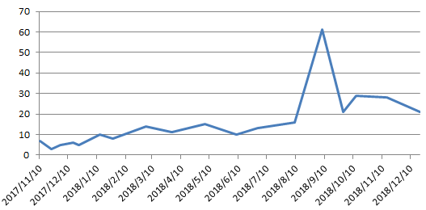

今天是平安夜，我并不打算过

2018是孤独的一年，越过越茫然，越来越焦虑的一年。似乎什么都想做却什么都做不好。也没人在意。

# 工作 1分

- 1月到7月，527

- 8月到10月，535

- 11月到现在，没什么明确的

太惨啦。有什么进步吗？我以为会有，但事实没有

# 生活 4分

想不出来，看看淘宝购物记录好了

- 看了孤独而灿烂的神·鬼怪，买了孔侑日历，然而现在还停留在第一页2018的开始
- 2月份，过年回家
- 5月份，看了四世同堂，很喜欢
- 疯狂吃草莓ing
- 6月份，买了赖世雄从头学美语，只看了俩单元:disappointed:
- 7月，ipad屏幕又碎了，自己动手换了。还不错
- 8月，妈妈来了，去了迪士尼
- 10月，看了排球少年，很好看
- 11月，买了灌篮高手漫画，收藏
- 12月，买了天猫精灵，挺好玩的。听歌也很好

6月到8月有一份短暂的感情，结局不是很好，自己也不够好。

# 健康 1分

一张图查看我的健康状况

# 展望

生活总要有展望，不然怎么过的下去呢。不然怎么过的下去呢。

2018并不好，不管是工作、生活或者健康。其实从这个排序就感受到了自己心中的排名，我很在意工作，我很在意能得到别人的肯定。我太在意了

工作：

- 做好准备，不做大公司里的小白兔
- 努力学习，4月份之前给自己找到新的offer
- 不要太在意，不要太在意别人对自己的看法，不要太在意别人对自己的看法，什么评比，什么打分，什么加薪，去他妈的

生活：

- 11点前上床睡觉
- 保证每天可以学习至少两个小时
- 健康饮食，按时吃饭
- 勤打扫卫生
- 不喝咖啡！
- 体重减到120以下！！

