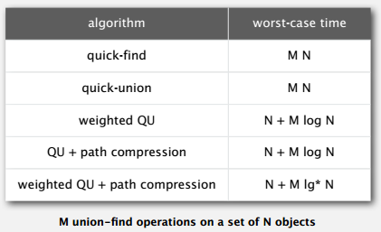
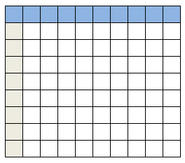
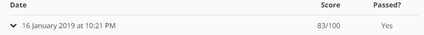

> 这门课也学习很久了 但真的是搞不懂他的题目 看一次放弃一次（也许英语太差了）
>
> 另外真的要吹爆Nokia，Coursera上面可以学习的课程越来越多 我都跟不上

## Week 1

Week 1 主要介绍的是连通问题

介绍了连接节点的概念，以及部分算法，实际上就是以**树**的概念来查看/连接节点。



书中介绍统计时间复杂度的方式我不是很明白，似乎下一周的课程会讲，待研究。

## [Project Percolation](http://coursera.cs.princeton.edu/algs4/checklists/percolation.html)

这是一个连通问题，根据坐标随机Open一个点，直到第一行和最后一行路径可通，称为percolation（渗透）。


### API：

```java
public class Percolation {
   public Percolation(int n)                // create n-by-n grid, with all sites blocked
   public    void open(int row, int col)    // open site (row, col) if it is not open already
   public boolean isOpen(int row, int col)  // is site (row, col) open?
   public boolean isFull(int row, int col)  // is site (row, col) full?
   public     int numberOfOpenSites()       // number of open sites
   public boolean percolates()              // does the system percolate?

   public static void main(String[] args)   // test client (optional)
}
```

- 初始化

  - 因为坐标是从(1,1)开始的，因此要按照给定的表格大小n+1，又为了验证是否渗透，另加一行代表最后一行。

    

  - union第0行的所有格子和最后一行的所有。第0行和n+1行都为Open的。只要验证第一个格子和最后一个格子是不是connect即可。

  - 灰色的格子不用

- Open:  这个格子会变蓝 

  - col为1不管
  -  (1,1)是Open的， (2,2)不是
  - 当一个格子被设为open时， 需要union上下左右open的格子

- isOpen: 看它是不是Open的

- isFull：这个点到第一行是不是通的

- numberOfOpenSites

- percolates： 好了没

### How to compile:

cmd里面是找不到`javac-algs4`的，要在project中

- javac-algs4 Percolation.java
- java-algs4 Percolation

### How to test：

Option 1：

- java-algs4 PercolationVisualizer input2-no.txt

Option 2:

- run with arugument : input2.txt

最后可与png图片做对比

### backwash

为了避免backwash一般有两种方法


- 建两个虚拟节点，两个openflag的数组分别代表第一行、最后一行的连通（为了避免backwash）

- 建两个WeightedQuickUnionUF的数组

- 最后采用的取消底部节点

  Instead of using a BOTTOM point connecting to all the last points in last row. just deciding whether percolate by testing any point in last row connected to TOP point.

### 结果



当然不是很好，主要败在了性能上面 用到了太多的connect和unit（据说使用find更快）

###坑：

- 题意不懂 不知道怎么入手 Percolation这个类要自己建 测试main函数要自己写
- java不熟悉
- 完全不知道怎么用给定的两个类
- 说是要用WeightedQuickUnionUF这个类，但是怎么用？刚开始还以为是要实现这个算法...:scream:
- 格子的坐标从(1,1)开始，即左上角格子。:crying_cat_face:
- 多建一行避免不了backwash。。。


