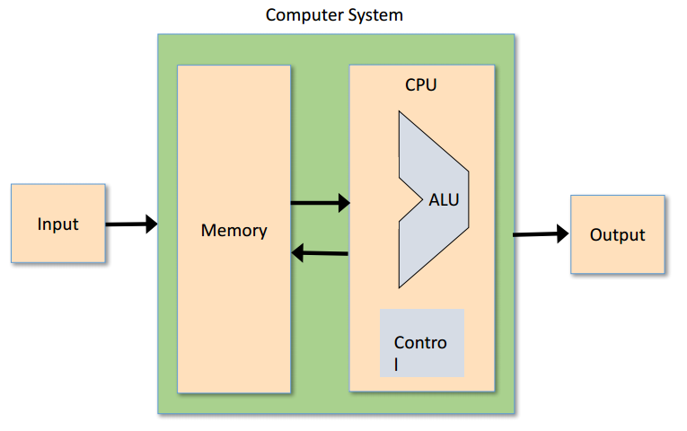

Week2 BooleanArithmetic
------

课程的一开始介绍了二进制，补码，加减算法。略。

## Negative numbers 

首先要明白为什么计算机中不使用正常的负数来做运算

因此，计算机中使用了补码

也就是说，在补码中，对于有符号数$x$如何取反，即所有位取反后加1即可。

## The Arithmetic Logic Unit

课程中的ALU由固定函数组成，通过控制位来确定执行哪个函数。乘除运算皆可基于此实现。

## [Project 2: Combinational Chips](https://www.nand2tetris.org/project02)

分别实现了半加器，全加器，自增以及ALU运算

[code](https://github.com/liuyanfight/OpenCourse/tree/master/From%20Nand%20to%20Tetris/project02)

遇到的问题

- 可以分别指定输入参数或输出参数中的某几位
- 名称为``out`的参数不可以再作为入参
- `Mux16`是可以作为选择器的，也就是if
- `Or8Way`可以判断8个bit中是否存在1